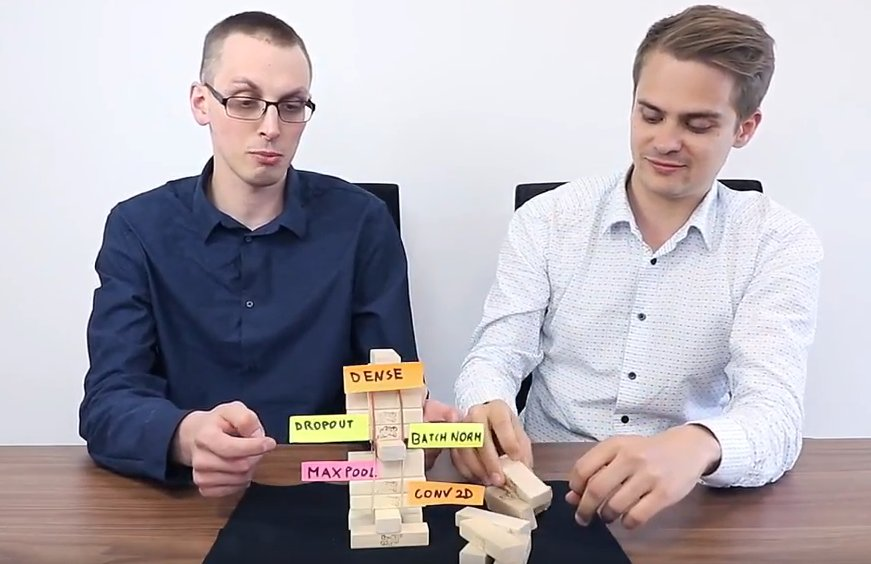

# intel-ai-webinar-neural-networks

[https://www.crowdcast.io/e/neural-network-blocks/register]()

sign up: [How to actually build a neural network from blocks? #Intel #AI](https://www.crowdcast.io/e/neural-network-blocks/register) (6 July 2017, worldwide)

The webinar is a part of the [Intel Software Student Developer Program for AI](https://software.intel.com/en-us/experts/ambassadors).

Content and installation instructions in [notebook_fresh.ipynb](https://github.com/deepsense-io/intel-ai-webinar-neural-networks/blob/master/notebook_fresh.ipynb).
